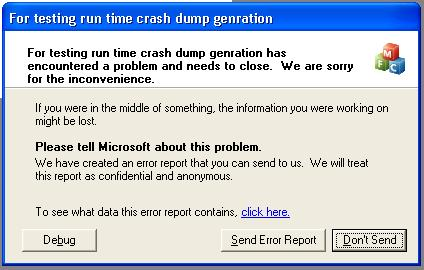

# cs42_tsunami
Proyect which consists of creating a C program that causes a simple buffer overflow in a Windows XP 32-bit environment. The buffer owerflow will be perform by strcpy function.

## Getting Started
A Windows XP virtual machine was used to perform the project. Another possible options is using a Docker container.

### Installing Windows XP Virtual Machine 
You can easily create a virtual machine with **vagrant** following the following steps:
1. [Install VirtualBox](https://www.virtualbox.org/wiki/Downloads) in your machine
2. [Install vagrant](https://www.vagrantup.com/downloads)
3. Run [WindowsXP_sp3_visual_studio.sh](WindowsXP_sp3_visual_studio.sh)
4. Open virtual machine with virtualbox

Once it is already installed, virtualbox is used to boot up and open it.

VirtualBox lets having shared clipboards and to drag files between host and guest machines. You can enable it in the top menú:
- **Shared Clipboard**: Devices > Shared Clipboard > Bidirectional
- **Drag and Drop**: Devices > Drag and Drop > Bidirectional

## Fast Usage
1. Compile [tsunami.c](tsunami.c) and [payload.c](payload.c)
2. Send them to guest machine to the same folder (this can be made by dragging them with virtualbox function)
3. Run payload:
```bash
./payload
```

## Do it yourself
### Prerequisite
The following software is included in [used_software](used_software):
- findjmp.exe: Will search in the DLL that we tell it, instructions referring to the registry that we want.
- Ollydbg (Debugger): Debugger used to understand the process and obtain the shellcode instructions in hexadecimal.
- Dev Cpp: Used to compile C code

### Procedure
1. Encontrar la posición del argumento de retorno de la pila:
    1. Compile tsunami.c and run it in Windows XP with "AAAABBBBCCCCDDDDEEEEFFFFGGGGHHHHIIIIJJJJKKKKLLLLMMMMNNNNOOOOPPPPQQQQRRRRSSSSTTTTUUUUVVVVWWWWXXXXYYYYZZZZ" as argument
    2. A new window will pop up: 
        - 
2. E

## Other files
- [shellcode_calc.c](shellcode_calc.c) and [shellcode_cmd.c](shellcode_cmd.c): Are C files that execute some instructions in assembly language that open the calculator and the terminal respectively. They were used to obtain those instructions in hexadecimal with the debugger, which were later added to payload.c. Both files can be compiled and run with Microsoft Visual C++ which was already installed in Windows XP virtual machine.